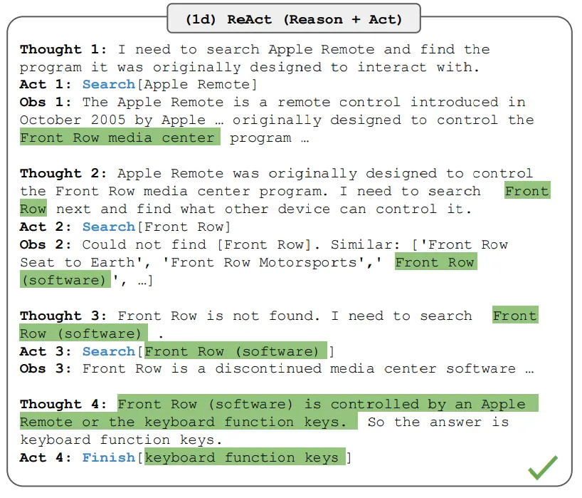

# ReAct 框架
推理和执行

从 Yao 等人，2022 引入了一个框架，其中 LLMs 以交错的方式生成 推理轨迹 和 任务特定操作 。

生成推理轨迹使模型能够诱导、跟踪和更新操作计划，甚至处理异常情况。操作步骤允许与外部源（如知识库或环境）进行交互并且收集信息。

ReAct 框架允许 LLMs 与外部工具交互来获取额外信息，从而给出更可靠和实际的回应。

结果表明，ReAct 可以在语言和决策任务上的表现要高于几个最先进水准要求的的基线。ReAct 还提高了 LLMs 的人类可解释性和可信度。总的来说，作者发现了将 ReAct 和链式思考 (CoT) 结合使用的最好方法是在推理过程同时使用内部知识和获取到的外部信息。

ReAct 的灵感来自于 “行为” 和 “推理” 之间的协同作用，正是这种协同作用使得人类能够学习新任务并做出决策或推理。

链式思考 (CoT) 提示显示了 LLMs 执行推理轨迹以生成涉及算术和常识推理的问题的答案的能力，以及其他任务 (Wei 等人，2022)。但它因缺乏和外部世界的接触或无法更新自己的知识，而导致事实幻觉和错误传播等问题。

ReAct 是一个将推理和行为与 LLMs 相结合通用的范例。ReAct 提示 LLMs 为任务生成口头推理轨迹和操作。这使得系统执行动态推理来创建、维护和调整操作计划，同时还支持与外部环境(例如，Wikipedia)的交互，以将额外信息合并到推理中。

原理如下：
