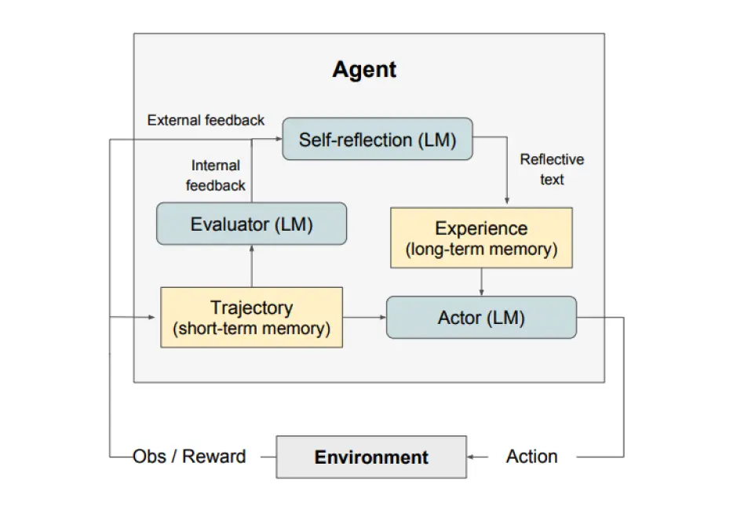
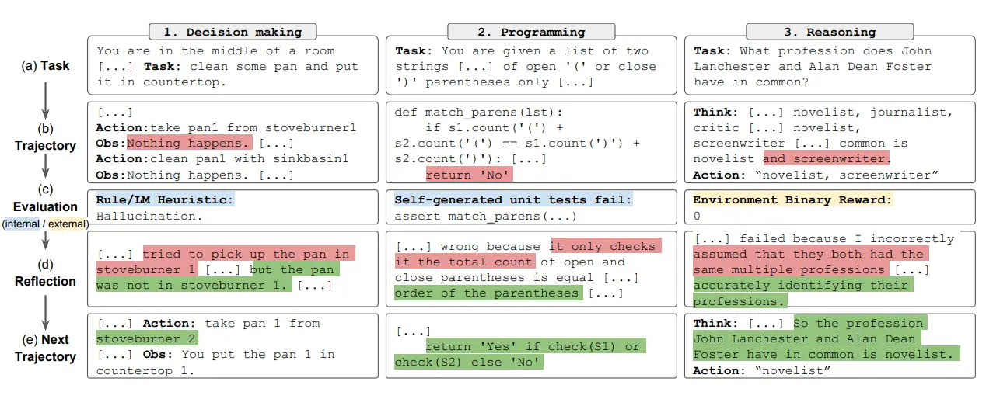

# 自我反思 self-reflexion
自我反思是一个通过语言反馈来强化基于语言的智能体的框架。根据 Shinn et al. (2023)，“自我反思是一种‘口头’强化的新范例，它将策略参数化为智能体的记忆编码与 LLM 的参数选择配对。”

在高层次上，自我反思将来自环境的反馈（自由形式的语言或者标量）转换为语言反馈，也被称作 self-reflection，为下一轮中 LLM 智能体提供上下文。这有助于智能体快速有效地从之前的错误中学习，进而提升许多高级任务的性能。

整体架构如下：

如上图所示，自我反思由三个不同的模型组成：

- 参与者（Actor）：根据状态观测量生成文本和动作。参与者在环境中采取行动并接受观察结果，从而形成轨迹。链式思考（CoT） 和 ReAct 被用作参与者模型。此外，还添加了记忆组件为智能体提供额外的上下文信息。
- 评估者（Evaluator）：对参与者的输出进行评价。具体来说，它将生成的轨迹（也被称作短期记忆）作为输入并输出奖励分数。根据人物的不同，使用不同的奖励函数（决策任务使用LLM和基于规则的启发式奖励）。
- 自我反思（Self-Reflection）：生成语言强化线索来帮助参与者实现自我完善。这个角色由大语言模型承担，能够为未来的试验提供宝贵的反馈。自我反思模型利用奖励信号、当前轨迹和其持久记忆生成具体且相关的反馈，并存储在记忆组件中。智能体利用这些经验（存储在长期记忆中）来快速改进决策。

总的来说，自我反思的关键步骤是:
- a) 定义任务，
- b) 生成轨迹，
- c)评估，
- d)执行自我反思，
- e)生成下一条轨迹。
  
下图展示了自我反思的智能体学习迭代优化其行为来解决决策、编程和推理等各种人物的例子。自我反思（Refelxion）通过引入自我评估、自我反思和记忆组件来拓展 ReAct 框架。

# 何时自我反思？
自我反思最适合以下情况：

1. 智能体需要从尝试和错误中学习：自我反思旨在通过反思过去的错误并将这些知识纳入未来的决策来帮助智能体提高表现。这非常适合智能体需要通过反复试验来学习的任务，例如决策、推理和编程。
2. 传统的强化学习方法失效：传统的强化学习（RL）方法通常需要大量的训练数据和昂贵的模型微调。自我反思提供了一种轻量级替代方案，不需要微调底层语言模型，从而使其在数据和计算资源方面更加高效。
3. 需要细致入微的反馈：自我反思利用语言反馈，这比传统强化学习中使用的标量奖励更加细致和具体。这让智能体能够更好地了解自己的错误，并在后续的试验中做出更有针对性的改进。
4. 可解释性和直接记忆很重要：与传统的强化学习方法相比，自我反思提供了一种更可解释、更直接的情景记忆形式。智能体的自我反思存储在其记忆组件中，让分析和理解其学习过程变得更加简单。

自我反思在以下任务中是有效的：

- 序列决策：自我反思提高了智能体在 AlfWorld 任务中的表现，涉及在各种环境中导航并完成多步目标。
- 推理：自我反思提高了 HotPotQA 上智能体的性能，HotPotQA 是一个需要对多个文档进行推理的问答数据集。
- 编程：自我反思的智能体在 HumanEval 和 MBPP 等基准测试上编写出了更好的代码，在某些情况下实现 SOTA 结果。

以下是自我反思的一些限制：

1. 依赖自我评估能力：反思依赖于智能体准确评估其表现并产生有用反思的能力。这可能是具有挑战性的，尤其是对于复杂的任务，但随着模型功能的不断改进，预计自我反思会随着时间的推移而变得更好。
2. 长期记忆限制：自我反思使用最大容量的滑动窗口，但对于更复杂的任务，使用向量嵌入或 SQL 数据库等高级结构可能会更有利。
3. 代码生成限制：测试驱动开发在指定准确的输入输出映射方面存在限制（例如，受硬件影响的非确定性生成器函数和函数输出）。

